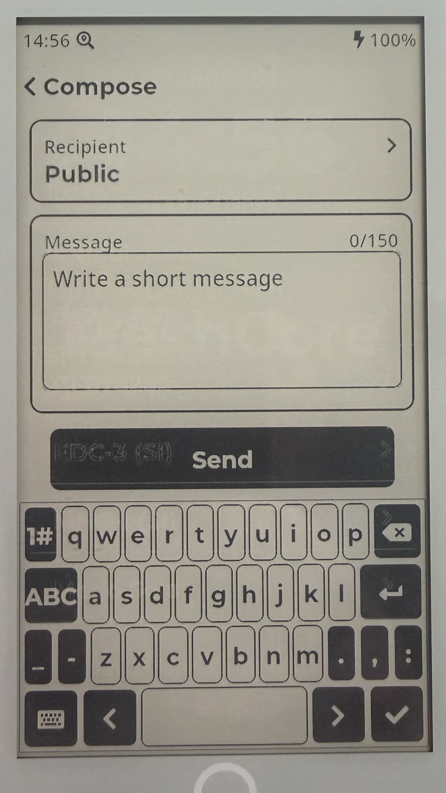
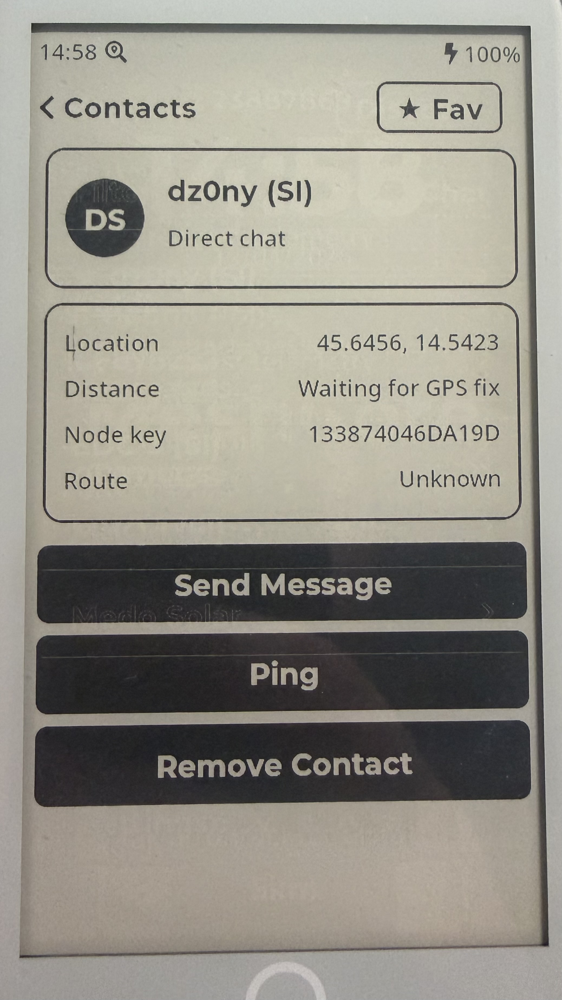
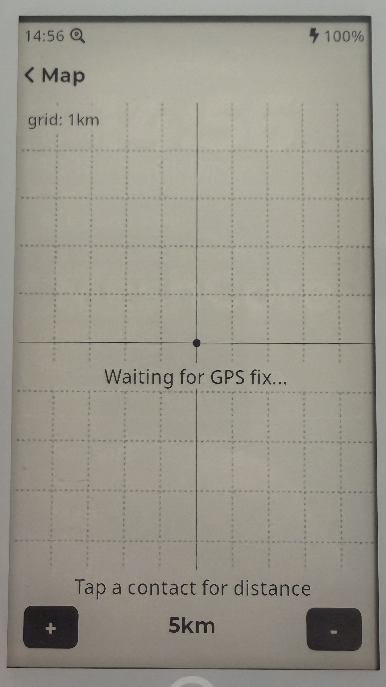
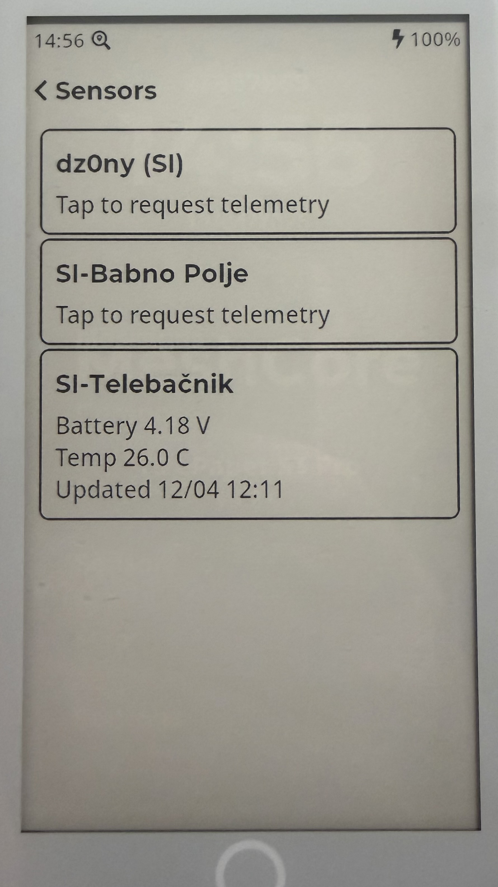

<h1 align="center">MeshCore T5 ePaper S3 Pro - ChatGPT update</h1>

<p align="center">
  A paper-like handheld MeshCore communicator for the LilyGo T5 ePaper S3 Pro<br>
  This is a modified version of the original project with a new Meshcore base and GREATLY improved touch screen response.
  All coded from ChatGPT and tested locally. The Bluetooth functionality has been seperated out to be a separate boot mode so there is either BT mode or UI.
  There is also an improved lock screen requiring a long press of the BOOT button and a quick start preset manager with name entry.
  All presets available in Meshcore are now listed
</p>

<p align="center">
  
  
  
  
</p>

MeshCore T5 ePaper S3 Pro turns the LilyGo T5 ePaper S3 Pro into a dedicated long-range mesh messaging device with a calm, readable e-ink interface.
It is built for people who want simple off-grid communication, strong battery-friendly readability, and a UI that feels more like paper than a phone.
It can be used as a standalone mesh device or as a companion-connected MeshCore node.

## Two operating modes (v0.3.1.20 test build)

- **PaperUI mode:** BLE controller is not initialized. The full UI, GT911
  sampler, maps and tracking retain their original memory budget.
- **BLE companion mode:** enabling BLE in PaperUI settings saves the selection
  and reboots. Only MeshCore, the BLE service, and a static mode notice
  run; there is no LVGL interface or touch input. Hold the physical `BOOT`
  button for two seconds to save BLE off and restart PaperUI mode.
- The BLE notice shows how to reconnect to PaperUI. It is painted before BLE
  advertising starts and never displays stale battery/unread figures; there
  is no panel rendering while the app is connected. Use the app for live data.

On the first PaperUI boot after this version is installed, a dismissible welcome
screen offers a device name and exact frequency/bandwidth/SF/CR radio presets.
Choosing **Keep existing settings** retains the stored identity and radio profile;
the welcome screen will not recur. Selecting a new preset/name saves it and
restarts so the mesh radio applies the changes. The listed frequencies are
examples, not regional regulatory advice: use only settings allowed at your
location and matching the other nodes on your mesh.

Without an SD card, this fork stores its identity and settings in SPIFFS.

## Why This Device

- Readable in daylight with an always-on e-paper feel
- Built for low-distraction messaging and status checking
- Long-range LoRa mesh communication without relying on normal internet access
- Purpose-built interface instead of a generic developer demo

## What You Can Do

- Send and receive mesh messages
- Browse contacts and recent conversations
- Discover nearby or recently heard nodes
- Check battery, GPS, and radio status
- Configure display, mesh, BLE, storage, and device settings directly on the device
- Use it as a companion-connected device as well as a standalone handheld

## Screens

- Home screen with time and at-a-glance device status
- Contacts list and contact detail views
- Chat list, message detail, and compose screens
- Discovery screen for recently heard mesh nodes
- Status, battery, GPS, map, and sensors screens
- Settings screens for mesh, display, BLE, GPS, and storage

## Main Functions

- 1:1 and device-to-device mesh messaging
- Standalone operation or companion-connected MeshCore use
- Contact management directly on the handheld
- Node discovery and quick visibility into nearby mesh activity
- On-device battery, radio, and location awareness
- Simple touch navigation optimized for e-paper readability

## Experience

The interface is designed around the strengths of e-paper:

- Large readable typography
- Minimal visual noise
- Clear black-and-white presentation
- Fast access to the most important actions
- No animation-heavy UI patterns

## Built For

- Off-grid communication setups
- Outdoor field use
- Low-power portable mesh terminals
- People who prefer dedicated hardware over a phone-first workflow

## Install

### Local Build

```bash
# PlatformIO environment name: t5-epaper
uvx platformio run -e t5-epaper
```

Flash over USB:

```bash
# esptool.py --chip esp32s3 --port /dev/ttyACM0 write_flash 0x10000 meshcore-paperui-v0.3.1.29-mc1.17.1-t5-epaper.bin 
```
Change /dev/ttyACM0 to the correct port on your PC

## Hardware

- LilyGo T5 ePaper S3 Pro
- ESP32-S3
- 4.7" e-paper display
- SX1262 LoRa radio
- Capacitive touch
- GPS support
- On-device storage with SPIFFS and SD card

Product page: [lilygo.cc/en-us/products/t5-e-paper-s3-pro](https://lilygo.cc/en-us/products/t5-e-paper-s3-pro)

## Project Focus

This project is not trying to be a general-purpose tablet UI.
It is a focused mesh communicator with a paper-like display, tuned for clarity, simplicity, and practical field use.

## ORIGINAL Repository

- GitHub: [dz0ny/meshcore-t5-epaepr-pro](https://github.com/dz0ny/meshcore-t5-epaepr-pro)
